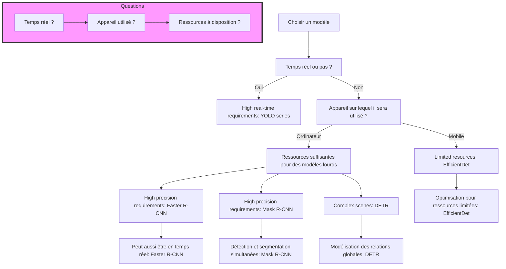

```mermaid

  

graph TD
    A[Choisir un modèle] --> B[Temps réel ou pas ?]
    B -->|Oui| C[High real-time requirements: YOLO series]
    B -->|Non| D[Appareil sur lequel il sera utilisé ?]
    
    D -->|Mobile| E[Limited resources: EfficientDet]
    D -->|Ordinateur| F[Ressources suffisantes pour des modèles lourds]

    F --> G[High precision requirements: Faster R-CNN]
    F --> H[High precision requirements: Mask R-CNN]
    F --> I[Complex scenes: DETR]

    E --> J[Optimisation pour ressources limitées: EfficientDet]
    
    G --> K[Peut aussi être en temps réel: Faster R-CNN]
    H --> L[Détection et segmentation simultanées: Mask R-CNN]
    I --> M[Modélisation des relations globales: DETR]
    
    %% Subgraph pour les questions
    subgraph Questions
        Q1[Temps réel ?] --> Q2[Appareil utilisé ?]
        Q2 --> Q3[Ressources à disposition ?]
    end

    style Questions fill:#f9f,stroke:#333,stroke-width:4px

```